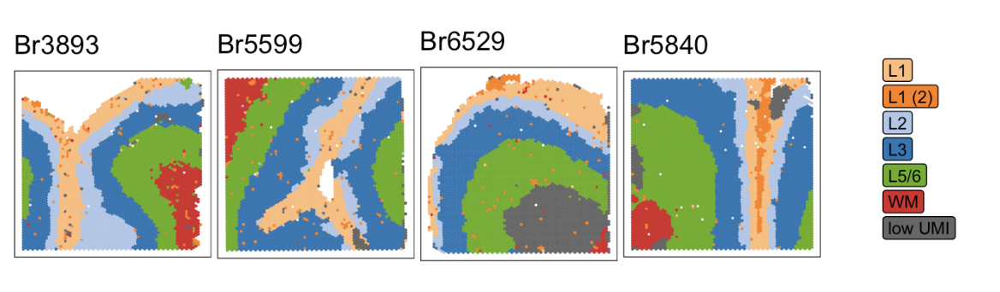
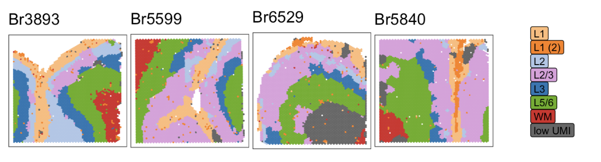
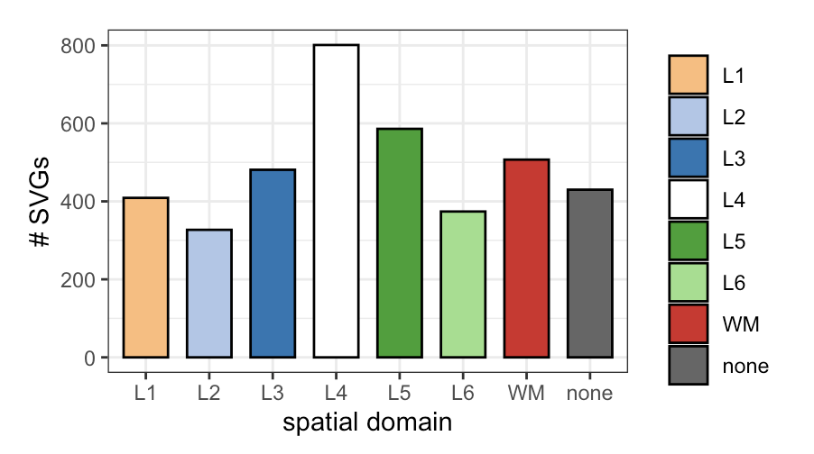
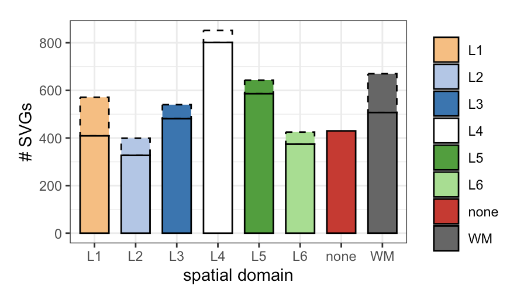
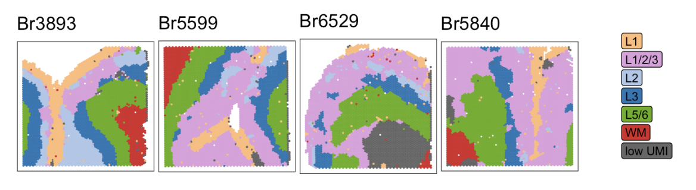
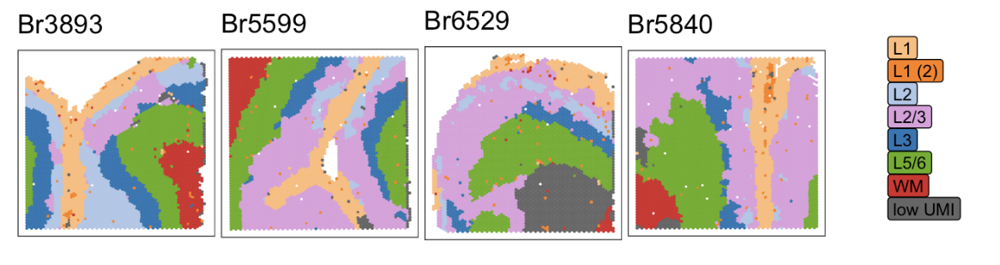

```{r setup, include = FALSE}
knitr::opts_chunk$set(
    collapse = TRUE,
    comment = "#>",
    eval = FALSE
)
```

### The importance of feature selection

A crucial step in single cell/nucleus RNAseq analysis is the implementation of clustering algorithms to generate groups of cells/nuclei with similar gene expression patterns. These clusters are often necessary to classify observations (cells/nuclei) based on cell state (cell type, developmental stage, etc.) to unleash the potential of the single cell/ nucleus approach.

Clusters are generated based on patterns of expression of a subset of features, and the selection of these features is highly influential to the downstream results. When selecting features for dimension reduction and clustering, genes from the mitochondrial genome, known sex-linked genes, or cell cycle genes (depending on the dataset) are often removed from consideration. These “biological quality controls” can help produce clusters representing desired cell state by removing expression patterns linked to donor sex or cell size.

Since canonical cell state marker genes will be highly expressed in one subset of observations and lowly expressed or absent in all others, common feature selection methods identify genes with highly variable expression within the dataset. Such methods often rely on modeling the mean-variance relationship and allow for the consideration of potential batch effects in these models. Batch consideration enables data-driven exclusion of features that capture technical noise or biological differences not relevant to the classification of cell state.

#### Feature selection in spatial transcriptomics

In spatially resolved transcriptomics (SRT), the individual observations are not single cells or single nuclei, but rather single points in 2D space (on a tissue section). These x- and y-coordinates are preserved through sequencing, such that the processed transcriptomic data can reconstruct gene expression patterns that vary across different regions of tissue present in the same section. The goal of clustering in SRT datasets is often to use gene expression patterns to identify known spatial domains (e.g., different cortical layers of the brain).

The extra spatial dimension (x/y coordinates) in SRT can be capitalized upon to identify features that have variable expression not only between observations but between different regions of the tissue section (spatially variable genes or SVGs). SVG selection methods often out-perform classic single cell or nuclei methods in generating features that recapitulate known spatial domains.

However, SVG selection methods do not permit for the consideration of user-defined batch effects that may introduce technical noise or other sources of variation that may prevent or distort spatial domains.

### The problem

While analyzing a 10X Visium SRT dataset from the human DLPFC, we recognized the need to evaluate our SVGs for the potential influence of batch effects in order to optimize spatial domain clustering.

We used [nnSVG](https://www.nature.com/articles/s41467-023-39748-z) to select 2098 statistically significant SVGs and then used [PRECAST](https://www.nature.com/articles/s41467-023-35947-w) to identify clusters that hopefully strongly corresponded to the cortical layers in the DLPFC. Using K=7 or K=8, we were unable to distinguish L5 from L6 with this set of features. We also identified a cluster of observations that appeared to be driven by low UMI count rather than expression of SVGs.

*Figure 1.1 PRECAST clusters: 2098 input features (SVGs), K=7*

<p align="center">

{width="84%"}

</p>

*Figure 1.2 PRECAST clusters: 2098 input features (SVGs), K=8*

<p align="center">

{width="84%"}

</p>

The lack of distinction between L5 and L6 did not appear to be due under-representation of known gene markers for these cortical layers in the SVG set. (DLPFC layer markers pulled from [Huuki-Meyers et. al, 2024](https://www.science.org/doi/abs/10.1126/science.adh1938) Table S8.)

*Figure 1.3 The SVG set comprises known marker genes for all DLPFC layers.*

<p align="center">

{width="66%"}

</p>

Nevertheless, we supplemented the SVG set with the most significant markers for each cortical layer (top 100 lowest FDR for each layer), adding 327 features to the input for clustering. We found that the number of L5 and L6 markers increased mildly, indicating that the most striking L5 and L6 markers were already included in the SVG list.

*Figure 1.4 Adding the most significant marker genes marginally increases the SVG set.*

<p align="center">

{width="66%"}

</p>

Supplementing the SVGs with additional layer markers did not improve spatial domain clustering with PRECAST at K=7 or K=8.

*Figure 1.5 PRECAST clusters: 2425 input features (SVGs + layer markers), K=7*

<p align="center">

{width="84%"}

</p>

*Figure 1.6 PRECAST clusters: 2425 input features (SVGs + layer markers), K=8*

<p align="center">

{width="84%"}

</p>

This led us to hypothesize that a small number of features within the SVG list were capturing technical variation in gene expression.

### The goal

Our goal is to use feature selection methods that can account for batch effects to flag SVGs that may be strongly influenced by technical factors. By examining the per-gene variance/deviance with and without a batch effect, we aim to identify features that could be interfering with the generation of clusters that correspond to known DLPFC spatial domains.
